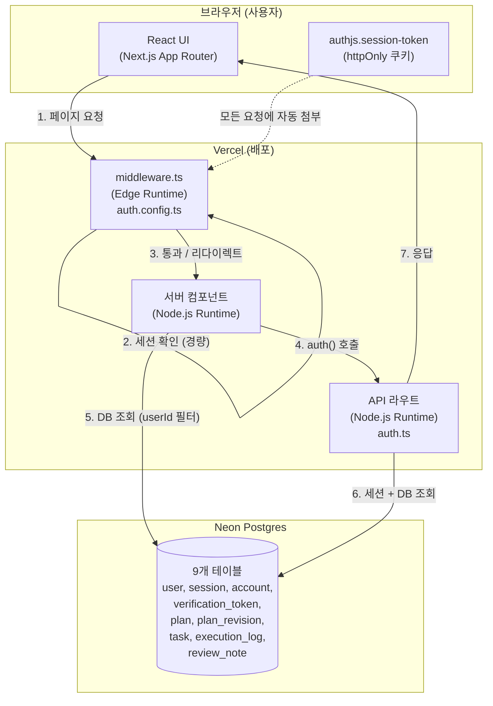
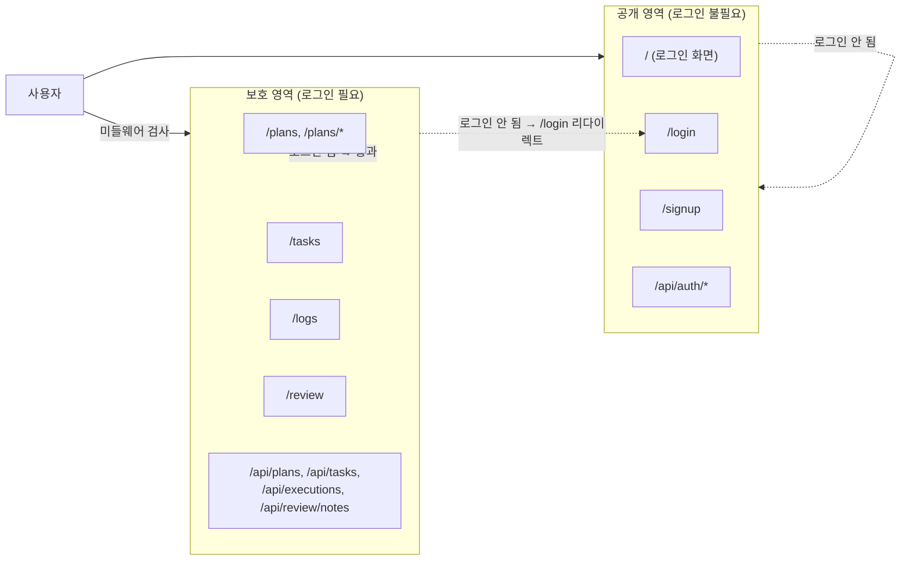
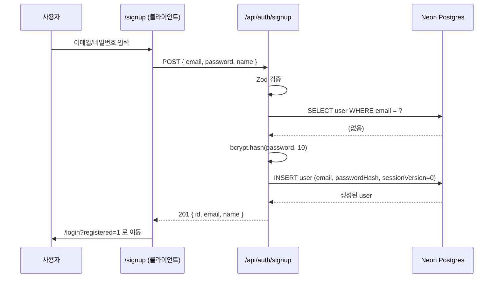
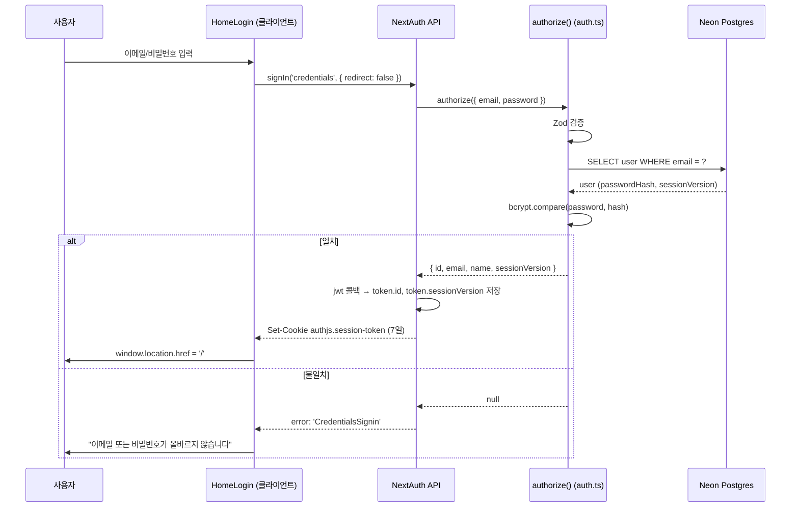
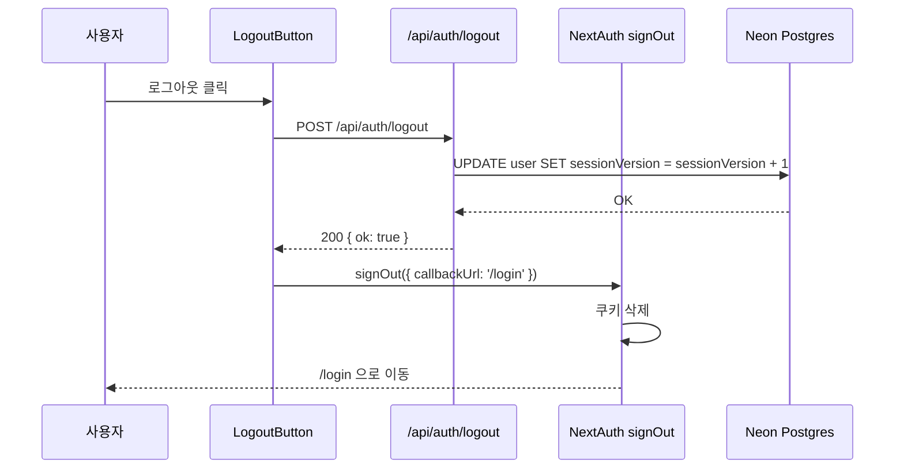
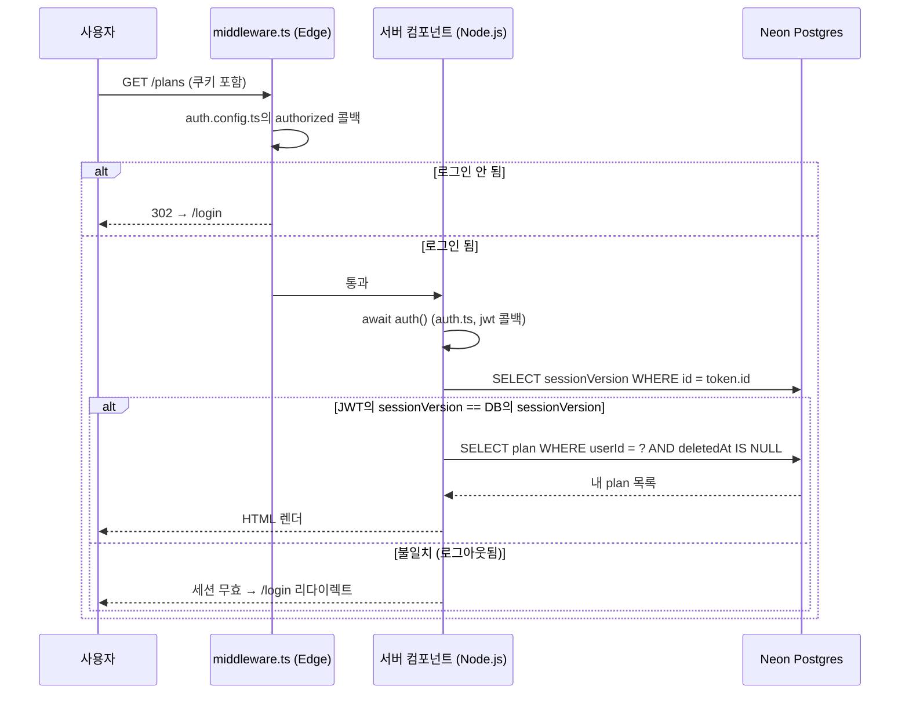
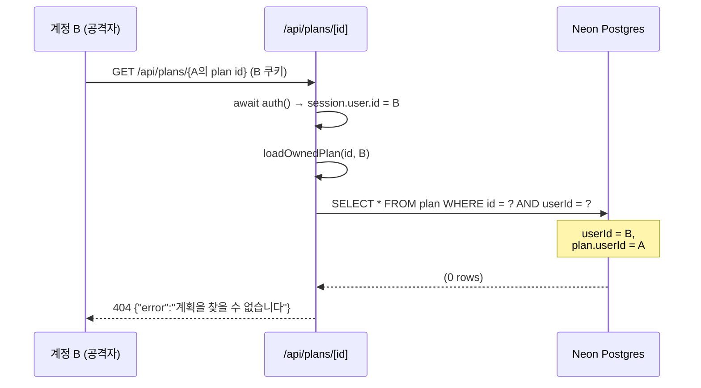
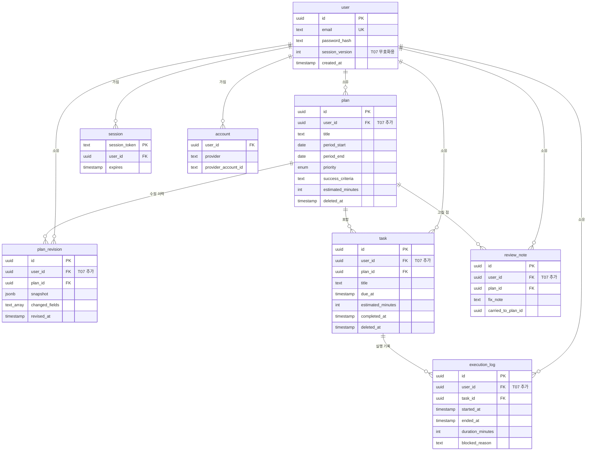
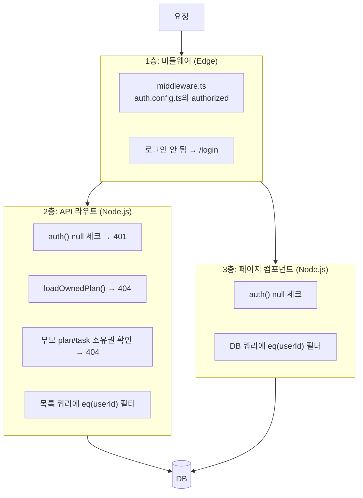
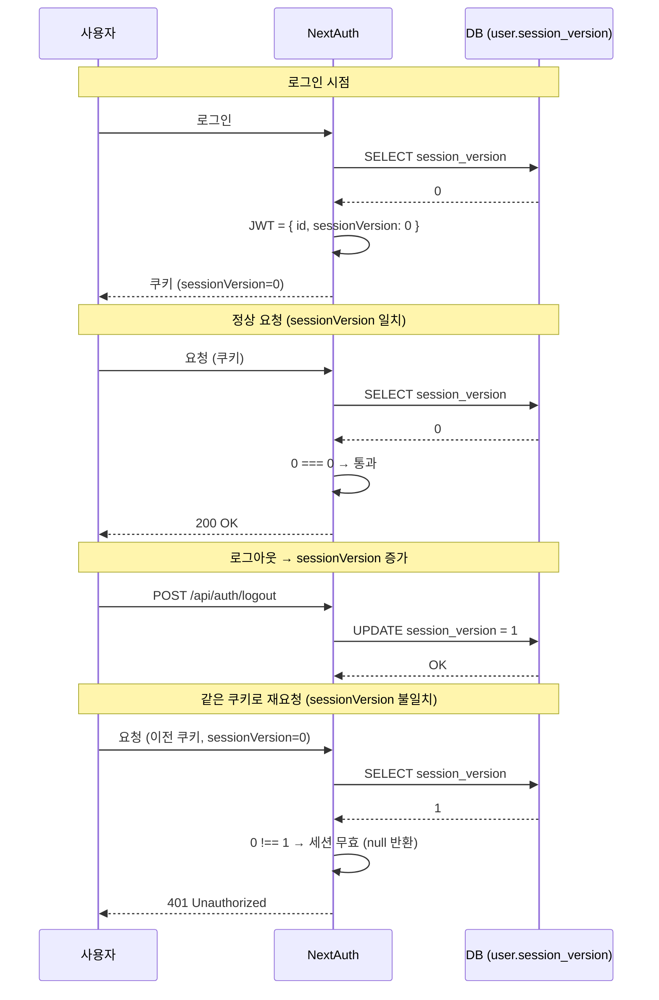

# 플랜두씨 다이어리 2 — 프로젝트 구조와 아키텍처

> T07: 인증이 붙은 다이어리 앱의 구조, 요청 흐름, 인증 경계, 데이터 모델을 그림으로 설명합니다.

---

## 목차

1. [전체 아키텍처](#1-전체-아키텍처)
2. [디렉터리 구조](#2-디렉터리-구조)
3. [인증 경계 (Authentication Boundary)](#3-인증-경계-authentication-boundary)
4. [요청 흐름](#4-요청-흐름)
   - [4.1 가입 흐름](#41-가입-흐름)
   - [4.2 로그인 흐름](#42-로그인-흐름)
   - [4.3 로그아웃 흐름](#43-로그아웃-흐름)
   - [4.4 보호 경로 접근](#44-보호-경로-접근)
   - [4.5 남의 자료 접근 시도 (거절)](#45-남의-자료-접근-시도-거절)
5. [데이터 모델 (ERD)](#5-데이터-모델-erd)
6. [소유권 검사 지점](#6-소유권-검사-지점)
7. [JWT + sessionVersion 무효화 메커니즘](#7-jwt--sessionversion-무효화-메커니즘)
8. [파일별 역할 요약](#8-파일별-역할-요약)

---

## 1. 전체 아키텍처



**핵심**:
- **미들웨어(Edge)**는 `auth.config.ts`만 로드 → `bcryptjs`/`DrizzleAdapter` 미포함 → Edge 안전
- **서버 컴포넌트/API 라우트(Node.js)**는 `auth.ts`(전체 설정) 로드 → DB 접근 가능

---

## 2. 디렉터리 구조

```
sktassign6_plandosee/
├── src/
│   ├── auth.config.ts          ← Edge 안전 경량 설정 (미들웨어 전용)
│   ├── auth.ts                 ← NextAuth 전체 설정 (Node.js 런타임)
│   ├── middleware.ts           ← 보호 경로 리다이렉트 (Edge)
│   │
│   ├── app/
│   │   ├── layout.tsx          ← SessionProvider로 감쌈
│   │   ├── page.tsx            ← 루트: 로그인 여부 분기
│   │   ├── login/page.tsx      ← HomeLogin 재사용
│   │   ├── signup/page.tsx     ← 회원가입
│   │   ├── plans/              ← 계획 (list, new, [id])
│   │   ├── tasks/              ← 할 일 목록
│   │   ├── logs/               ← 실행 기록 목록
│   │   ├── review/             ← 돌아보기 집계
│   │   └── api/
│   │       ├── auth/
│   │       │   ├── [...nextauth]/route.ts   ← NextAuth 핸들러
│   │       │   ├── signup/route.ts          ← 회원가입
│   │       │   └── logout/route.ts          ← 로그아웃 (sessionVersion++)
│   │       ├── plans/
│   │       │   ├── route.ts                 ← GET (내 것만) / POST
│   │       │   └── [id]/route.ts            ← GET/PUT/DELETE (loadOwnedPlan)
│   │       ├── tasks/route.ts
│   │       ├── executions/route.ts
│   │       └── review/notes/route.ts
│   │
│   ├── components/
│   │   ├── ui/                 ← shadcn/ui 컴포넌트
│   │   └── domain/
│   │       ├── HomeLogin.tsx          ← 로그인 UI (클라이언트)
│   │       ├── HomeDashboard.tsx      ← 로그인 후 홈
│   │       ├── LogoutButton.tsx       ← 로그아웃
│   │       ├── PlanForm.tsx           ← 계획 생성/수정
│   │       └── ... (기존 T06 컴포넌트)
│   │
│   ├── db/
│   │   ├── index.ts            ← Drizzle 연결 (Neon HTTP)
│   │   └── schema.ts           ← 9개 테이블 정의
│   │
│   ├── lib/
│   │   ├── aggregate.ts        ← 집계 함수
│   │   ├── time.ts             ← KST 유틸
│   │   ├── validate.ts         ← Zod 스키마
│   │   └── export.ts           ← JSON 내보내기
│   │
│   └── types/
│       └── next-auth.d.ts      ← Session 타입 확장 (user.id)
│
├── docs/
│   └── screenshots/            ← 5일 기록 스크린샷
│
├── contracts/
│   └── pds-schema-v2.json
│
├── tests/                      ← Vitest
│
├── submission-note.md          ← 인증 설명서 6항목
├── submission-checklist.md     ← T07-C01~C134 대응표
├── README.md
└── structure.md                ← 이 문서
```

---

## 3. 인증 경계 (Authentication Boundary)



| 영역 | 경로 | 미들웨어 | 세션 필요 |
|------|------|----------|-----------|
| 공개 | `/`, `/login`, `/signup`, `/api/auth/*` | 통과 | 아니오 |
| 보호 | 그 외 모든 경로 | 검사 후 리다이렉트 | 예 |
| API | `/api/plans`, `/api/tasks`, ... | 통과 (자체 검사) | 예 (라우트 내부 `auth()`) |

---

## 4. 요청 흐름

### 4.1 가입 흐름



### 4.2 로그인 흐름



### 4.3 로그아웃 흐름



**핵심**: sessionVersion이 증가했으므로, 이전에 발급된 JWT는 **다음 요청부터 무효** (jwt 콜백에서 감지).

### 4.4 보호 경로 접근



### 4.5 남의 자료 접근 시도 (거절)



**핵심**: `id`는 일치하지만 `userId`가 불일치 → **404** (존재 자체를 감춤).

---

## 5. 데이터 모델 (ERD)



**T07 추가 사항**:
- `user` 테이블 신규 (계정)
- `session`, `account`, `verification_token` (NextAuth Adapter 요구)
- `user.sessionVersion` (무효화용)
- **5개 도메인 테이블에 `user_id` 추가** (FK + index)

---

## 6. 소유권 검사 지점



### 거절 소스 위치 (T07-C126)

| 지점 | 파일 | 조건 | 응답 |
|------|------|------|------|
| 미들웨어 | `middleware.ts` | 로그인 안 됨 + 보호 경로 | 302 → `/login` |
| API 세션 | 각 API 라우트 | `auth()` null | 401 |
| API 소유권 | `src/app/api/plans/[id]/route.ts`의 `loadOwnedPlan()` | `plan.userId ≠ session.user.id` | 404 |
| API 부모 | `src/app/api/tasks/route.ts` 등 | 부모 plan/task 소유자 ≠ 나 | 404 |
| API 목록 | 각 API의 GET | `eq(table.userId, session.user.id)` | 내 것만 |
| 페이지 | `src/app/plans/page.tsx` 등 | `eq(plan.userId, session.user.id)` | 내 것만 |

---

## 7. JWT + sessionVersion 무효화 메커니즘



**핵심**:
- JWT 자체는 여전히 유효 (서명 검증 통과)
- 하지만 **매 요청마다 DB의 `session_version`과 비교**하여 **무효화 감지**
- 로그아웃/비밀번호 변경 시 `session_version += 1` → 이전 JWT 전부 무효

---

## 8. 파일별 역할 요약

### 인증 핵심 파일

| 파일 | 런타임 | 역할 |
|------|--------|------|
| `src/auth.config.ts` | Edge + Node | 경량 설정 (pages, providers=[], authorized 콜백) |
| `src/auth.ts` | Node | 전체 설정 (DrizzleAdapter, Credentials, jwt/session 콜백) |
| `src/middleware.ts` | Edge | `NextAuth(authConfig).auth` — 보호 경로 리다이렉트 |
| `src/app/api/auth/[...nextauth]/route.ts` | Node | NextAuth 핸들러 (GET, POST) |
| `src/app/api/auth/signup/route.ts` | Node | 회원가입 (bcrypt.hash, user INSERT) |
| `src/app/api/auth/logout/route.ts` | Node | sessionVersion += 1 |
| `src/types/next-auth.d.ts` | — | Session.user.id 타입 확장 |

### 소유권 검사 파일

| 파일 | 방식 |
|------|------|
| `src/app/api/plans/[id]/route.ts` | `loadOwnedPlan()` 헬퍼 → 404 |
| `src/app/api/plans/route.ts` | GET에 `eq(userId)` / POST에 `session.user.id` 주입 |
| `src/app/api/tasks/route.ts` | 부모 plan 소유권 확인 |
| `src/app/api/executions/route.ts` | 부모 task 소유권 확인 |
| `src/app/api/review/notes/route.ts` | 부모 plan 소유권 확인 |
| `src/app/page.tsx` | `auth()` + `eq(plan.userId)` |
| `src/app/plans/page.tsx` | `auth()` + `eq(plan.userId)` |
| `src/app/plans/[id]/page.tsx` | `auth()` + `and(eq(plan.id), eq(plan.userId))` |
| `src/app/tasks/page.tsx` | `auth()` + `eq(task.userId)` |
| `src/app/logs/page.tsx` | `auth()` + `eq(executionLog.userId)` |
| `src/app/review/page.tsx` | `auth()` + `eq(task.userId)` |

---

## 관련 문서

- **`submission-note.md`** — 인증 구현 설명서 6항목 + 5일 기록
- **`submission-checklist.md`** — T07-C01~C134 대응표
- **`README.md`** — 프로젝트 소개
- **`contracts/pds-schema-v2.json`** — 스키마 문서 (자동 생성)

---

**작성일**: 2026-09-17
**최종 갱신**: (5일 후)